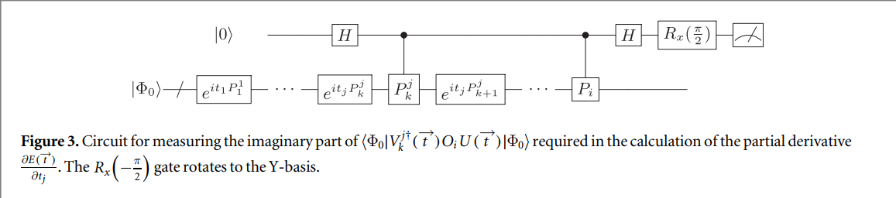

# Strategies for quantum computing molecular energies using the unitary coupled cluster ansatz

[Quantum Science and Technology, vol. 4 (2018), pp. 14008](https://research.google/pubs/pub46226/)

## Introduction

1. Variational quantum eigensolver for UCC
    1. Preparation of the wavefunction by application of parameterized state preparation unitaries;
    2. Determination of the expectation value of every term in the Hamiltonian via an efficient partial tomography;
    3. Calculation of the total energy and determination of a new set of state preparation parameters in a classical computer.
2. To prepare the UCC ansatz on a quantum computer, we need map the UCC operator onto qubits. Since excitation operators in the UCC operators do not necessarily commute, the UCC unitary can be approximated using trotterization:
    $$
    U(\vec{t}) \approx U_{\text {Trot }}(\vec{t})=\left(\prod_{j} \mathrm{e}^{\frac{t_{j}}{\rho}\left(\tau_{j}-\tau_{j}^{\dagger}\right)}\right)^{\rho}
    $$
3. JW transformation:
    $$
    \left(\tau_{j}-\tau_{j}^{\dagger}\right)=\mathrm{i} \sum_{k}^{2 l_{j}-1} P_{k}^{j}
    $$
    - Furthermore, we can show that the subterms derived from the same $\left(\tau_{j}-\tau_{j}^{\dagger}\right)$ operator commute (see appendix), which allow us to simplify the expression of the complex cluster unitary as follows:
        $$
        U_{1}(\vec{t})=\prod_{j} \prod_{k}^{2^{2 l_{k}-1}} \exp \left(\mathrm{i} t_{j} P_{k}^{j}\right)
        $$
4. We can estimate the total number of measurements, $m$, as:
    $$
    m=\frac{\sum_{j}^{M}\left|h_{j}\right| \sum_{i}^{M}\left|h_{i}\right| \operatorname{Var}\left[\left\langle O_{i}\right\rangle\right]}{\epsilon^{2}} \leqslant \frac{\left(\sum_{j}^{M}\left|h_{j}\right|\right)^{2}}{\epsilon^{2}} .
    $$
5. Classical CCSD employ the CC amplitudes obtained from perturbation theory $(\mathrm{MP} 2)$ as starting guesses to solve for the CC equations. The MP2 guess amplitudes are given by the equations:
$$
t_{i}^{a}=0 ; \quad t_{i j}^{a b}=\frac{h_{i j b a}-h_{i j a b}}{\epsilon_{i}+\epsilon_{j}-\epsilon_{a}-\epsilon_{b}}
$$
where $\epsilon_{p}$ stands for the HF energy of the orbital $p$ and $h_{p q r s}$ represent the two electron integrals (equation (4)).
6. Energy gradient:
    $$
    \frac{\partial E(\vec{t})}{\partial t_{j}}=2 \sum_{i}^{M} h_{i}\left(\sum_{k}^{N_{s}^{j}} c_{k}^{j} \operatorname{Im}\left(\left\langle\Phi_{0}\left|V_{k}^{j \dagger}(\vec{t}) O_{i} U(\vec{t})\right| \Phi_{0}\right\rangle\right)\right) .
    $$
    where:
    $$
    \begin{aligned}
    &V_{k}^{j}(\vec{t})=\exp \left(\mathrm{i} t_{j} P_{1}^{1}\right) \cdots \exp \left(\mathrm{i} t_{j} P_{k-1}^{j}\right) P_{k}^{j} \exp \left(\mathrm{i} t_{j} P_{k}^{j}\right) \\
    &\quad \times \exp \left(\mathrm{i} t_{j} P_{k+1}^{j}\right) \cdots \exp \left(\mathrm{i} t_{N_{P}} P_{N_{S}^{N_{N}}}^{N_{p}}\right) .
    \end{aligned}
    $$
    We can evaluate the imaginary part of $\left\langle\Phi_{0}\left|V_{k}^{j \dagger} H_{i} U(\vec{t})\right| \Phi_{0}\right\rangle$ with the circuit of figure 3:
    
    - We can get an upper bound of measurement by considering the upper bound of the variance:
    $$
    \tilde{m}_{j} \leqslant 4 \frac{\left(\sum_{i}^{M}\left|h_{i}\right|\right)^{2}}{\tilde{\epsilon}_{j}^{2}} .
    $$
7. A particular strategy that could be exploited to reduce the number of quantum resources for a VQE-UCC calculation is the complete active space (CAS) approach [73]. The CAS approximation consists in dividing the orbital space into a set of inactive (I) and active (A) orbitals such as the occupation of the orbitals in the inactive space remains unchanged.

## Algorithm (JW transformation for example)

1. Preparation of the wavefunction by application of parameterized state preparation unitaries;
   1. Define the molecular in the OpenFermion, get necessary parameters such as number of qubits.
   2. Prepare the HF state by JW transformation
   3. Prepare the Unitary by JW transformation
   4. Prepare the Hamiltonian by the OpenFermion and do the JW transformation
2. Determination of the expectation value of every term in the Hamiltonian via an efficient partial tomography;
   1. Applied the Unitary on the HF state by trotterization
   2. Simulate the energy expectation
   3. Calculate the energy gradient by calculation or simulation
3. Calculation of the total energy and determination of a new set of state preparation parameters in a classical computer.
   1. Optimize the parameter in Unitary.